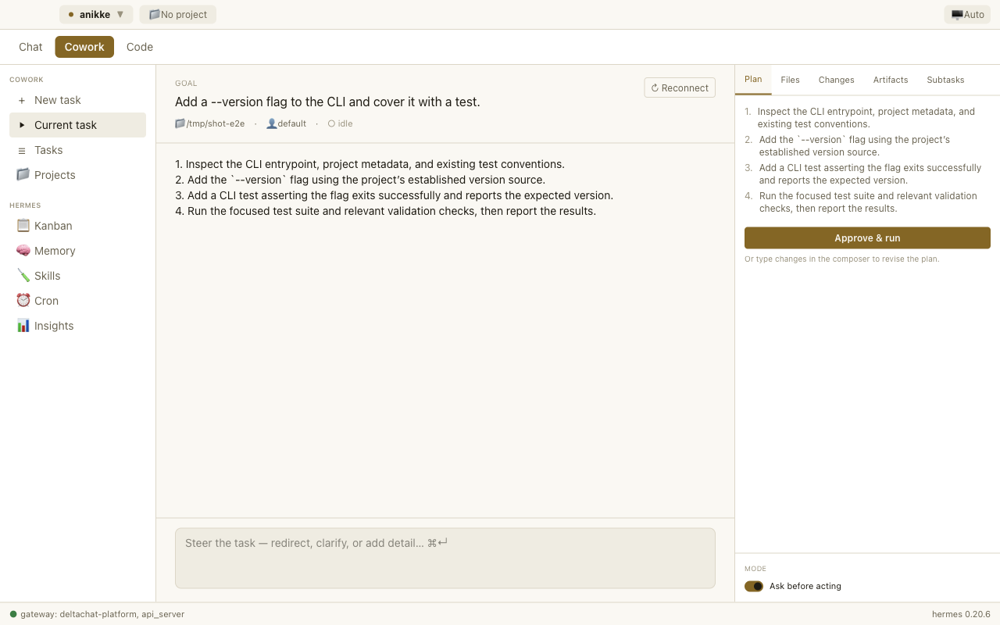

# Hermes Cowork

> A Claude-Cowork-style desktop app for [Hermes Agent](https://github.com/NousResearch/hermes-agent). Open source. Local-first. Multi-agent.



## What this is

Hermes Cowork wraps the [Hermes Agent](https://github.com/NousResearch/hermes-agent)
CLI in a desktop app inspired by Anthropic's Claude Cowork — three modes
(**Chat / Cowork / Code**), a plan-then-approve task flow with inline approvals,
live progress, projects that scope every session to a folder, file checkpoints
with one-click revert, and parallel worker agents that a coordinator synthesises.

Unlike Claude Cowork, Hermes Cowork is fully open source (MIT), runs entirely
local-first, and lets multiple isolated agent profiles cooperate on one task.

## Status

**macOS Apple Silicon.** All three modes work end to end against a real Hermes.
Windows/Linux packaging and a signed/notarised DMG are not done yet
(build steps in [`docs/release-checklist.md`](docs/release-checklist.md)).

What's in:

- **Projects** — a name + a local folder + the Hermes profile to run as.
  Create / switch / rename / archive / remove (removing never deletes the
  folder). Chat and Cowork run inside the active project; Hermes auto-loads
  `AGENTS.md` / `.hermes.md` from it (see
  [`docs/project-context.md`](docs/project-context.md)).
- **Cowork** — kickoff → the agent proposes a numbered plan and stops →
  **Approve & run** → execution with inline approvals. Tasks are persistent and
  resumable (Tasks page); a crashed session reloads with **↻ Reconnect**; the
  approval mode is enforced agent-side via ACP session modes.
- **Checkpoints** — every edit snapshots the file first. The **Changes** tab
  shows a diff and a **Revert** (restores the pre-edit content, or deletes a
  new file).
- **Multi-agent** — the **Subtasks** tab dispatches worker agents (goal +
  profile), with bounded concurrency, per-worker timeouts, and `depends-on`
  ordering. **Synthesise results** feeds every finished worker's output back to
  the coordinator with provenance.
- **Code** — the active project's file tree beside the conversation.
- **Read-first Hermes surfaces** — Skills, Memory, Cron, Kanban, Insights, plus
  gateway start/stop/restart and a profile manager.
- **File browser** — read-only, confined to the project root (`..` and symlink
  escape are rejected).

## Requirements

- macOS 13+ (Apple Silicon)
- [Hermes Agent](https://hermes-agent.nousresearch.com/docs/getting-started/installation)
  ≥ 0.20.0 on `$PATH` (ACP verified against 0.20.6 — see
  [`docs/acp-notes.md`](docs/acp-notes.md))
- A running `hermes dashboard` on `127.0.0.1:9119` (the app reuses one or starts
  its own; it only kills a dashboard it started)

## Install

Download the latest DMG from the
[Releases page](https://github.com/avedelphina/hermes-cowork/releases/latest)
and drag it to Applications. (Releases begin once the DMG is signed.)

## Develop

Requires **Node 20** (see `.nvmrc`) and **pnpm 10** (pinned via `packageManager`;
run `corepack enable` once so the right version is selected automatically).

```bash
corepack enable        # first time only — activates the pinned pnpm
nvm use                # or otherwise select Node 20
pnpm install           # electron/esbuild binaries download via approved postinstall
pnpm dev
```

A clean checkout builds and launches with no manual steps:

```bash
pnpm -r typecheck && pnpm -r lint && pnpm -r test && pnpm -r build
```

Tests: `pnpm -r test` is fast unit tests. `pnpm --filter @hermes-cowork/desktop
exec playwright test` runs the e2e specs — the `cowork-flow` and `multi-agent`
ones drive a **real Hermes** and auto-skip when `hermes` is not installed.

If `electron` fails to launch after install, `node_modules` is stale — remove it
and reinstall. The `onlyBuiltDependencies` list in `pnpm-workspace.yaml` is what
lets Electron's binary download run under pnpm 10; do not delete it. If a shell
exports `ELECTRON_RUN_AS_NODE=1`, run `env -u ELECTRON_RUN_AS_NODE pnpm dev`.

## Architecture

A thin Electron/React presentation layer over Hermes.

- **`hermes acp`** — one pooled connection per profile for Chat/Code (fast
  session switching); a dedicated child per Cowork task and per worker so
  **Stop** can hard-cancel (Hermes 0.20.6 has no `session/cancel`). The bridge
  multiplexes many ACP sessions and routes events by session id.
- **`hermes dashboard`** — profiles, sessions, skills, kanban, gateway, cron.
  The renderer reaches it only through an **allow-listed** REST proxy in the
  main process.
- **State** — projects and tasks are plain JSON under `userData` (transcripts
  stay in Hermes and replay on resume via `session/load`). Both migrate forward
  on load.
- **Trust boundary** — the renderer never supplies a filesystem root or a
  dashboard path; roots resolve from the project/task registry by id, profile
  names are validated, external links are `http(s)`-only. See
  [`docs/security-model.md`](docs/security-model.md).

Renderer: React 19 + TypeScript + Tailwind v4 + wouter + zustand.

## Docs

| | |
|---|---|
| [`docs/operations.md`](docs/operations.md) | running it: setup, where state lives, troubleshooting, recovery |
| [`docs/security-model.md`](docs/security-model.md) | permission + approval contract, renderer→main trust boundary |
| [`docs/project-context.md`](docs/project-context.md) | how `AGENTS.md` / `.hermes.md` reach the agent |
| [`docs/acp-notes.md`](docs/acp-notes.md) | ACP wire shapes verified against Hermes 0.20.6 |
| [`docs/release-checklist.md`](docs/release-checklist.md) | pre-release gates, packaging, notarisation, upstream sync |
| `docs/superpowers/` | original design + implementation plans |

## License

MIT
